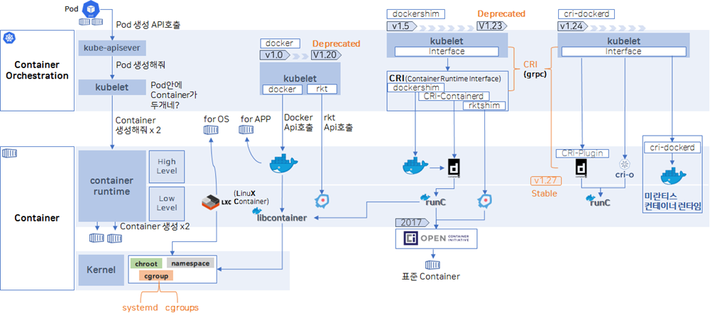
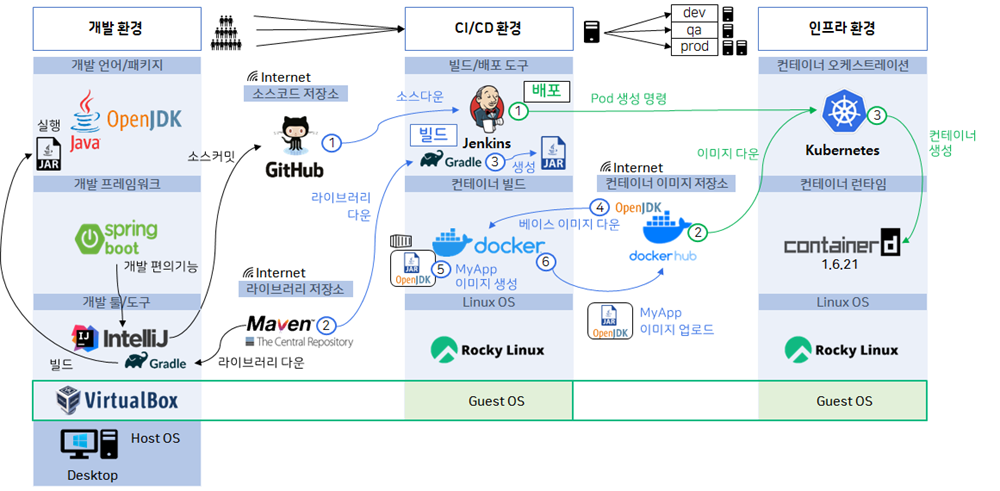

## 📚 다음 중 기술의 흐름으로 이해하는 컨테이너 발전 과정에 대한 설명으로 틀린 것은?
1. chroot, namespace, cgroup은 컨테이너 기술의 기반이 되는 Linux 커널 레벨 격리 기술이다
2. Containerd는 Docker의 여러기능들 중에 컨테이너를 생성을 담당한다. 
3. Docker는 LXC와 libcontainer를 기반으로 사용자 친화적인 High Level 컨테이너 런타임을 제공했다
4. Containerd로 생성한 컨테이너는 cri-o로는 실행할 수 없다. 

### 핵심 개념 정리
- 컨테이너는 VM이 아니라 Linux 커널 기능의 조합
- Docker → containerd → runc 구조로 역할 분리
- Kubernetes는 OCI 표준 기반 런타임(containerd, cri-o) 을 사용

### 선택지 해설
1️⃣ ✔ 맞음
- chroot : 파일시스템 격리
- namespace : PID / NET / IPC / MOUNT 격리
- cgroup : CPU / Memory 자원 제한
→ 컨테이너의 커널 레벨 기반 기술

2️⃣ ✔ 맞음
- Docker 아키텍처 분리 이후:
- Docker → High-level 도구
- containerd → 컨테이너 lifecycle 관리
- runc → 실제 컨테이너 실행
→ “컨테이너 생성 담당”이라는 설명은 흐름상 정확

3️⃣ ✔ 맞음
- 초기 Docker: LXC 기반
- 이후: libcontainer (자체 구현)
- 이미지, 빌드, 네트워크, CLI까지 제공 → 컨테이너 대중화

4️⃣ ❌ 틀림 (정답)
- containerd와 cri-o는 서로 다른 런타임 구현체
- 하지만 둘 다 OCI(Open Container Initiative) 표준을 따른다
- 동일한 OCI 이미지 사용 가능
    - ❌ “서로 실행 불가”
    - ✔ “동시에 공유 실행은 불가하지만 표준은 호환”

## 📚 다음 중 기술의 흐름으로 이해하는 쿠버네티스와 컨테이너 런타임의 관계에 대한 설명으로 틀린 것은?
1. 초기 쿠버네티스는 kubelet 내부에서 Docker와 rkt를 직접 구분하여 호출하는 구조였다
2. 컨테이너 런타임이 늘어나면서, 쿠버네티스는 CRI(Container Runtime Interface)를 도입했다
3. CRI 도입 이후, 컨테이너 런타임 변경 시 kubelet 코드를 수정할 필요가 없어졌다
4. 쿠버네티스 1.24 이후에는 Docker 기반 이미지가 더 이상 실행될 수 없게 되었다

### 핵심 개념 정리
- Kubernetes는 컨테이너를 직접 실행하지 않음
- kubelet ↔ 컨테이너 런타임 사이에 CRI 인터페이스 존재
- 제거된 것은 Docker 엔진, 이미지가 아님

### 선택지 해설
1️⃣ ✔ 맞음
- 초기 kubelet 내부에 dockershim / rkt 코드 존재
- 런타임 추가 시 kubelet 수정 필요 → 구조적 한계

2️⃣ ✔ 맞음
- 런타임 다양화 문제 해결 목적
- CRI(Container Runtime Interface) 도입

3️⃣ ✔ 맞음
- kubelet은 CRI만 호출
- containerd ↔ cri-o 교체 가능
- kubelet 코드 수정 불필요

4️⃣ ❌ 틀림 (정답)
- Kubernetes 1.24에서 제거된 것은 dockershim
- Docker 이미지 = OCI 이미지
- containerd / cri-o에서 여전히 실행 가능
    - ❌ Docker 이미지 실행 불가
    - ✔ Docker 엔진 직접 사용 불가  

출처: 네이버카페 큐브옵스 커뮤니티 (작성자: 알프로)
https://cafe.naver.com/f-e/cafes/30725715/articles/909?boardtype=C&menuid=55&referrerAllArticles=false
  
  

## 개발 환경 구성 (Local Development)
### 개발 도구
- PC = 개발 환경
- IDE: IntelliJ
- 언어/프레임워크: Java + OpenJDK + Spring Boot

### Spring Boot & Gradle 역할
Spring Boot:
- 복잡한 설정 없이 빠르게 애플리케이션 개발 가능
- 많은 기능을 코드 한 줄로 제공

Gradle의 역할:
1. 라이브러리 의존성 관리
- Maven Repository에서 필요한 라이브러리 자동 다운로드
- 리눅스에서 yum install이 의존성까지 설치해주는 것과 같은 개념
2. Build 수행
- 소스 코드를 컴퓨터가 실행 가능한 형태로 변환
- Java의 경우 결과물은 jar 파일

이 모든 과정은 IntelliJ 내부에서 자연스럽게 수행

## CI/CD 환경 구성
### CI/CD 환경의 특징
- 개발 환경과 달리 스크립트 기반 자동 설치
- 한 번에 환경 구성 가능
- 실무에서 매우 중요

### 구성 요소
- VirtualBox
- VM 1대 생성
    - Guest OS: Linux
- CI/CD 도구:
    - Jenkins
    - Docker (컨테이너 빌드용)

### 인프라 환경 구성 (Kubernetes)
- CI/CD 환경과 마찬가지로 VM 기반
- Linux 설치 후:
    - containerd
    - Kubernetes
모두 스크립트로 설치

## 전체 CI → CD → Kubernetes 배포 흐름
### 개발 → CI (Jenkins)
- 개발자가 IntelliJ에서 코드 작성
- GitHub에 소스 코드 push
- Jenkins가:
    - GitHub에서 소스 코드 pull
    - Gradle로 build 수행
    - jar 파일 생성

### 컨테이너 빌드 (Docker)
- 기존 방식: jar 파일을 서버에 직접 배포 → 끝
- 컨테이너 기반 방식: 
    1. Docker Hub에서 OpenJDK 베이스 이미지 pull
    2. 베이스 이미지 위에 jar 파일 추가
    3. 컨테이너 이미지 생성
    4. 생성된 이미지를 Docker Hub에 push

### 배포 (Kubernetes)
- Jenkins가 Kubernetes에 Pod 생성 명령 전달
- Kubernetes는:
    - Pod 정의에 있는 컨테이너 이미지 주소 확인
    - Docker Hub에서 이미지 pull
    - 해당 이미지로 컨테이너 실행
👉 이것이 컨테이너 기반 CI/CD + Kubernetes 배포의 핵심 흐름

## 환경 분리 개념
- CI/CD 환경: 보통 1개
- 인프라 환경: 여러 개
    - 개발(dev)
    - 검증(stage)
    - 운영(prod)

여러 개발자가 만든 소스가
→ 하나의 CI/CD 환경
→ 각 인프라 환경으로 배포되는 것이 일반적인 구조

## 📚 다음 중 쿠버네티스가 사용된 컨테이너 기반 DevOps 파이프라인에 대한 설명으로 틀린 것은?
1. 컨테이너 빌드시 Docker를 통해 Jar 파일과 컨테이너 이미지를 생성할 수 있다. 
2. 컨테이너 이미지 생성시 필요에 따라 Dockerhub로 부터 베이스 이미지를 다운 받기도 한다.
3. 배포를 위해서 쿠버네티스로 Pod 생성 명령을 보내기 전, Dockerhub에 이미지 업로드 과정이 선행 되어야 한다.
4. 쿠버네티스는 Pod 스펙에 정의된 정보를 기준으로 이미지를 다운 받고 컨테이너 런타임으로 생성을 요청한다.

### 핵심 개념 정리
- Jar 생성 ≠ Docker 역할
- Docker는 “빌드 도구”가 아니라 패키징 도구
- Kubernetes는 빌드 X / 실행 요청만 수행

### 선택지 해설
1️⃣ ❌ 틀림 (정답)
- Jar 생성 주체: Gradle / Maven
- Docker 역할: 이미 생성된 Jar를 베이스 이미지 위에 올려 컨테이너 이미지 생성
    - Docker는 Jar를 만들지 않는다

2️⃣ ✔ 맞음
FROM openjdk:17
Dockerhub / Private Registry에서 베이스 이미지 pull

3️⃣ ✔ 맞음 (일반적인 파이프라인 기준)
- Kubernetes는 이미지를 빌드하지 않음
- Pod 스펙에는 이미지 주소만 존재
- 따라서 레지스트리 업로드 선행 필요

4️⃣ ✔ 맞음
- kubelet → Pod 스펙 확인
- 이미지 주소 확인
- containerd에게 pull + 컨테이너 생성 요청

### 전체 핵심 요약
- Jar 생성: Gradle / Maven
- 컨테이너 패키징: Docker
- 컨테이너 실행: containerd / cri-o
- 오케스트레이션: Kubernetes
- Docker 제거 ≠ Docker 이미지 제거