# Learning eBPF Chapter 4

## The `bpf()` System Call

Chapter 3에서는 eBPF Bytecode가 어떤 형태로 구성되고, `bpftool`을 이용해 Program을 Kernel에 Load하면 어떤 결과가 나타나는지 살펴봤다. Chapter 4에서는 한 단계 더 아래로 내려가, User Space의 Loader가 실제로 어떤 System Call을 사용해 BTF, Map, Program을 Kernel에 등록하고, Program을 Event에 Attach하며, Kernel과 데이터를 주고받는지를 확인한다.

이 장의 핵심은 단순히 `bpf()`라는 System Call 하나를 외우는 것이 아니다. eBPF Application이 실행되기 위해 필요한 Kernel Object가 어떤 순서로 만들어지고, 각각의 Object가 File Descriptor를 통해 어떻게 참조되며, Program과 Map, Hook, Buffer의 생명주기가 어떻게 연결되는지를 이해하는 것이 중요하다.

이번 장에서는 BCC 예제인 `hello-buffer-config.py`를 `strace`로 추적하면서 다음 흐름을 확인한다.

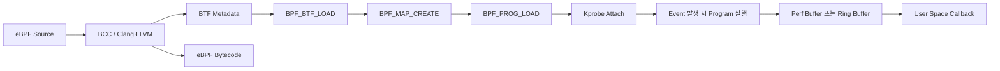

---

# 1. User Space와 Kernel을 연결하는 `bpf()` System Call

User Space Application은 Kernel Memory에 직접 접근할 수 없다. File을 열 때 `open()`, Network Socket을 만들 때 `socket()`, Memory Mapping을 수행할 때 `mmap()`을 사용하는 것처럼, eBPF Program과 Map을 생성하고 조작할 때도 System Call이 필요하다.

eBPF를 위한 대표적인 System Call은 다음과 같다.

```c
int bpf(int cmd, union bpf_attr *attr, unsigned int size);
```

`bpf()`는 하나의 고정된 작업만 수행하는 System Call이 아니다. 첫 번째 인자인 `cmd`에 따라 BTF를 Load하거나, Map을 만들거나, Program을 Load하거나, Map Entry를 수정하는 등 서로 다른 작업을 수행한다.

| Command | 역할 |
|---|---|
| `BPF_BTF_LOAD` | BTF Metadata를 Kernel에 등록 |
| `BPF_MAP_CREATE` | Kernel에 BPF Map Object 생성 |
| `BPF_PROG_LOAD` | eBPF Program을 검증하고 Kernel에 Load |
| `BPF_MAP_UPDATE_ELEM` | Map Entry 생성 또는 수정 |
| `BPF_MAP_LOOKUP_ELEM` | 특정 Key의 Value 조회 |
| `BPF_MAP_GET_NEXT_KEY` | Map 내부 Key 순회 |
| `BPF_MAP_GET_NEXT_ID` | Kernel에 존재하는 Map ID 순회 |
| `BPF_MAP_GET_FD_BY_ID` | Map ID를 Process-local FD로 변환 |
| `BPF_OBJ_GET_INFO_BY_FD` | FD가 가리키는 BPF Object의 Metadata 조회 |
| `BPF_OBJ_PIN` | BPF Object를 bpffs에 Pin |
| `BPF_LINK_CREATE` | Program과 Hook 사이의 BPF Link 생성 |

두 번째 인자인 `attr`은 Command별 세부 Parameter를 담는다. Map 생성이라면 Map Type, Key Size, Value Size, 최대 Entry 수 등이 들어가고, Program Load라면 Program Type, Instruction 개수, Bytecode 주소, License, BTF FD 등이 들어간다.

세 번째 인자인 `size`는 User Space가 전달한 `bpf_attr` 데이터의 크기다.

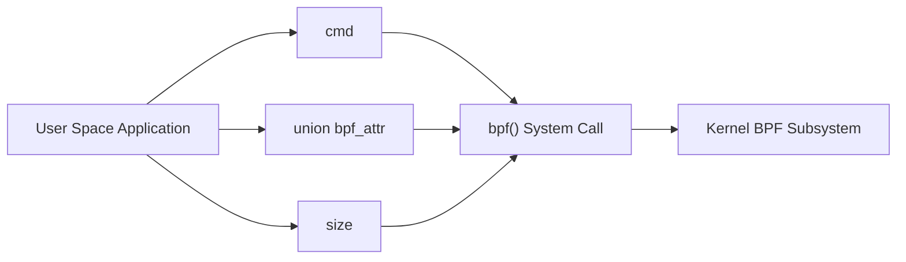

---

# 2. 예제 프로그램 `hello-buffer-config.py`

이번 장에서 사용하는 예제는 Chapter 2의 `hello-buffer.py`를 확장한 형태다. `execve()` Event가 발생하면 현재 Process의 PID, UID, Command Name을 수집하고, UID별 Message를 선택한 뒤 User Space로 전송한다.

## 2.1 사용자별 Message 구조체

```c
struct user_msg_t {
    char message[12];
};
```

`user_msg_t`는 12Byte 길이의 Message를 저장한다.

## 2.2 `config` Hash Map

```c
BPF_HASH(config, u32, struct user_msg_t);
```

`config` Map은 UID를 Key로 사용하고, `user_msg_t`를 Value로 저장한다.

```text
Key   : u32 UID, 4Byte
Value : struct user_msg_t, 12Byte
```

Python Loader는 다음과 같이 UID별 Message를 설정한다.

```python
b["config"][ct.c_int(0)] = ct.create_string_buffer(b"Hey root!")
b["config"][ct.c_int(501)] = ct.create_string_buffer(b"Hi user 501!")
```

논리적인 Map 상태는 다음과 같다.

```text
config[0]   = "Hey root!"
config[501] = "Hi user 501!"
```

## 2.3 `output` Perf Buffer

```c
BPF_PERF_OUTPUT(output);
```

`output`은 Kernel의 eBPF Program이 Event 데이터를 User Space로 보내기 위한 Perf Buffer Output Map이다.

`config`와 `output`의 역할은 서로 반대 방향이다.


`config` Map은 User Space가 Kernel Program에 설정을 전달하는 Control Plane 역할을 하고, `output`은 Kernel Program이 실행 결과를 User Space로 보내는 Output Channel 역할을 한다.

## 2.4 `hello()` 함수

```c
int hello(void *ctx) {
    struct data_t data = {};
    struct user_msg_t *p;
    char message[12] = "Hello World";

    data.pid = bpf_get_current_pid_tgid() >> 32;
    data.uid = bpf_get_current_uid_gid() & 0xFFFFFFFF;

    bpf_get_current_comm(&data.command, sizeof(data.command));

    p = config.lookup(&data.uid);

    if (p != 0) {
        bpf_probe_read_kernel(
            &data.message,
            sizeof(data.message),
            p->message
        );
    } else {
        bpf_probe_read_kernel(
            &data.message,
            sizeof(data.message),
            message
        );
    }

    output.perf_submit(ctx, &data, sizeof(data));
    return 0;
}
```

실행 흐름은 다음과 같다.

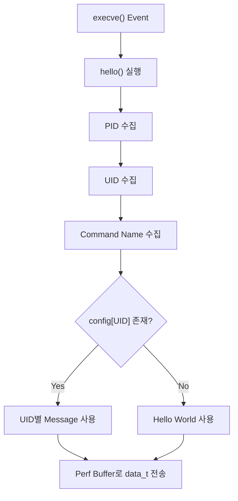

---

# 3. `strace`로 보는 전체 초기화 순서

예제를 다음과 같이 실행하면 `bpf()` 관련 System Call만 확인할 수 있다.

```bash
strace -e bpf ./hello-buffer-config.py
```

주요 출력은 다음과 같은 순서로 나타난다.

```text
bpf(BPF_BTF_LOAD, ...) = 3
bpf(BPF_MAP_CREATE, ... map_name="output" ...) = 4
bpf(BPF_MAP_CREATE, ... map_name="config" ...) = 5
bpf(BPF_PROG_LOAD, ... prog_name="hello" ...) = 6
bpf(BPF_MAP_UPDATE_ELEM, ...) = 0
bpf(BPF_MAP_UPDATE_ELEM, ...) = 0
```

전체 Sequence는 다음과 같다.

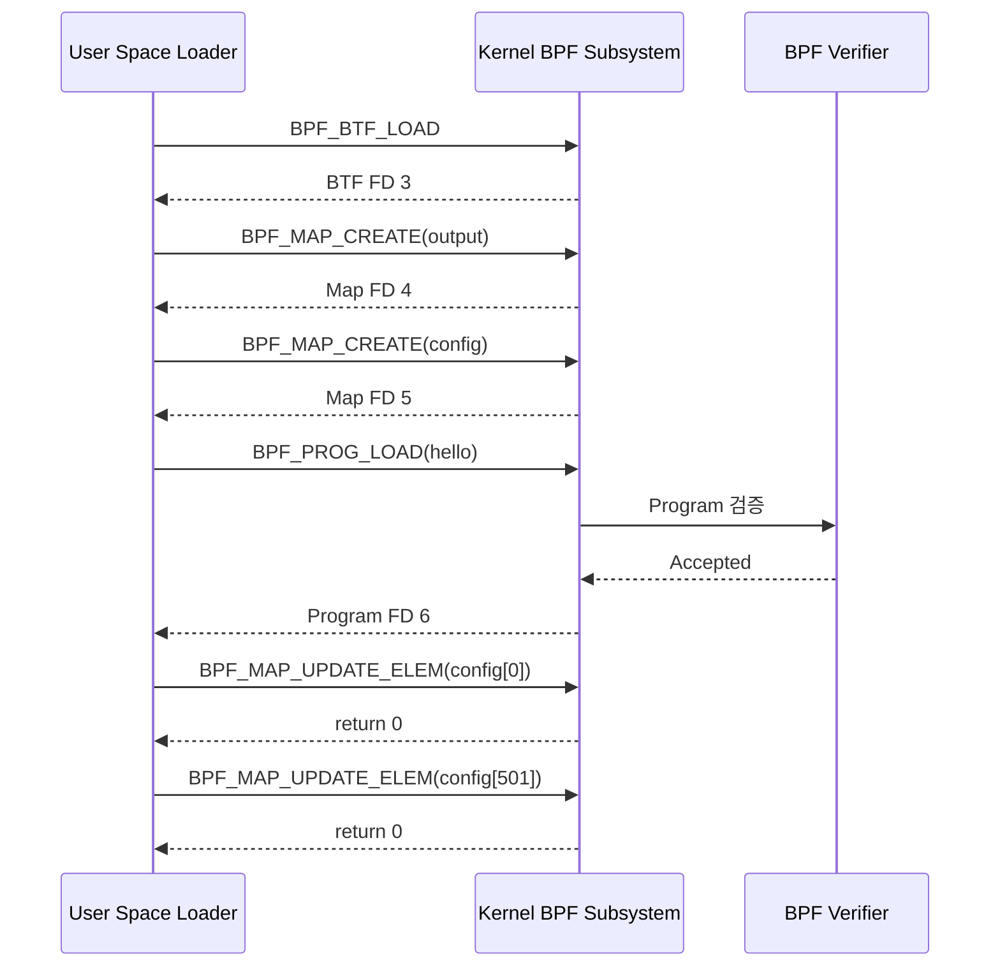

---

# 4. BTF Data Load

첫 번째 `bpf()` 호출은 BTF 데이터를 Kernel에 등록한다.

```text
bpf(BPF_BTF_LOAD, {btf="..."}, 128) = 3
```

BTF는 **BPF Type Format**의 약자로, Program과 Map에서 사용하는 Type Metadata를 표현한다. 구조체 이름, Field 이름, Type, Offset, 크기 등의 정보가 들어갈 수 있다.

예를 들어 다음 구조체가 있다면,

```c
struct user_msg_t {
    char message[12];
};
```

BTF에는 다음과 같은 정보가 포함될 수 있다.

```text
Type Name    : struct user_msg_t
Total Size   : 12Byte
Member Name  : message
Member Type  : char[12]
Member Offset: 0
```

`BPF_BTF_LOAD`는 이 Metadata Blob을 Kernel Object로 등록하고, 성공하면 이를 참조할 File Descriptor를 반환한다.

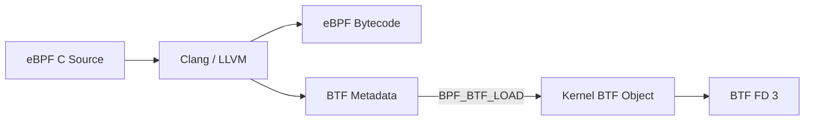

여기서 반환값 `3`은 성공 여부만 나타내는 숫자가 아니라 BTF Object를 가리키는 File Descriptor다.

> BTF와 CO-RE의 전체 동작은 Chapter 5에서 자세히 다룬다. Chapter 4에서는 BTF가 Program과 Map의 Type Metadata를 Kernel과 Tool에 제공한다는 점에 집중한다.

---

# 5. 두 개의 Map 생성

## 5.1 `output` Perf Event Array Map

첫 번째 Map 생성 호출은 다음과 같다.

```text
bpf(BPF_MAP_CREATE, {
    map_type=BPF_MAP_TYPE_PERF_EVENT_ARRAY,
    key_size=4,
    value_size=4,
    max_entries=4,
    map_name="output"
}, 128) = 4
```

이를 해석하면 다음과 같다.

```text
Map Type    : BPF_MAP_TYPE_PERF_EVENT_ARRAY
Map Name    : output
Key Size    : 4Byte
Value Size  : 4Byte
max_entries : 4
Return FD   : 4
```

이 Map은 일반 Event Data를 Key-Value로 저장하는 배열이 아니다. CPU별 Perf Event Output Channel을 연결하는 참조 배열이다.

```text
output[0] → CPU 0 Perf Event
output[1] → CPU 1 Perf Event
output[2] → CPU 2 Perf Event
output[3] → CPU 3 Perf Event
```

`max_entries=4`는 Event를 네 개까지만 저장한다는 뜻이 아니라, 실습 환경의 네 CPU에 대응하는 Perf Event Reference를 네 개 저장한다는 뜻이다.

## 5.2 `config` Hash Map

두 번째 Map 생성 호출은 다음과 같다.

```text
bpf(BPF_MAP_CREATE, {
    map_type=BPF_MAP_TYPE_HASH,
    key_size=4,
    value_size=12,
    max_entries=10240,
    map_name="config",
    btf_fd=3
}, 128) = 5
```

```text
Map Type    : BPF_MAP_TYPE_HASH
Map Name    : config
Key Size    : 4Byte
Value Size  : 12Byte
max_entries : 10,240
BTF FD      : 3
Return FD   : 5
```

`max_entries=10240`은 Source에서 크기를 따로 지정하지 않았기 때문에 적용된 BCC의 기본값이다.

`btf_fd=3`은 이 Map의 Key와 Value Type Metadata가 앞에서 Load한 BTF Object와 연결된다는 뜻이다. `bpftool`은 이 정보를 이용해 Raw Byte를 사람이 읽을 수 있는 구조체 형태로 출력할 수 있다.

## 5.3 두 Map 비교

| 항목 | `output` | `config` |
|---|---|---|
| Map Type | `BPF_MAP_TYPE_PERF_EVENT_ARRAY` | `BPF_MAP_TYPE_HASH` |
| Key | CPU Index | UID |
| Key Size | 4Byte | 4Byte |
| Value | Perf Event Reference | `user_msg_t` |
| Value Size | 4Byte | 12Byte |
| `max_entries` | CPU 수 4 | 10,240 |
| 역할 | Kernel → User Space | User Space → Kernel |
| 반환 FD | 4 | 5 |

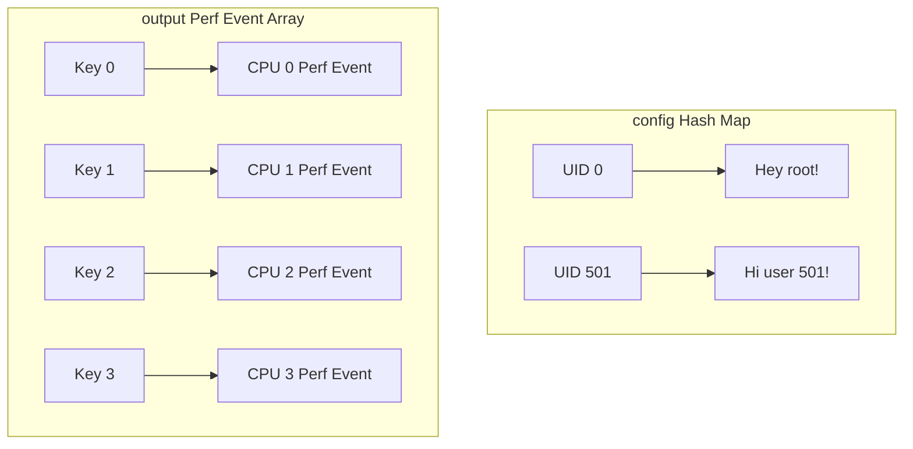

---

# 6. eBPF Program Load와 Verifier

Program Load 호출은 다음과 같다.

```text
bpf(BPF_PROG_LOAD, {
    prog_type=BPF_PROG_TYPE_KPROBE,
    insn_cnt=44,
    insns=0xffffa836abe8,
    license="GPL",
    prog_name="hello",
    expected_attach_type=BPF_CGROUP_INET_INGRESS,
    prog_btf_fd=3
}, 128) = 6
```

각 Field의 의미는 다음과 같다.

| Field | 의미 |
|---|---|
| `prog_type` | Program의 종류와 실행 규칙 |
| `insn_cnt=44` | eBPF Instruction Slot 수 |
| `insns` | Bytecode가 저장된 User Space 주소 |
| `license="GPL"` | GPL 전용 Helper 사용 가능 여부에 영향 |
| `prog_name="hello"` | Kernel에서 표시되는 Program 이름 |
| `prog_btf_fd=3` | Program Metadata와 BTF Object 연결 |
| 반환값 `6` | Load된 Program Object의 FD |

`BPF_PROG_TYPE_KPROBE`는 이 Program이 Kprobe 계열의 Context와 Helper 규칙을 사용한다는 의미다.

`insn_cnt=44`는 C Source Line이 44개라는 뜻이 아니라, Compile 결과가 44개의 eBPF Instruction Slot으로 구성되어 있다는 뜻이다. 기본 eBPF Instruction Slot은 8Byte이므로 단순 계산하면 352Byte에 해당한다.

```text
44 × 8Byte = 352Byte
```

`insns`는 Bytecode가 있는 User Space Virtual Address다. Kernel은 이 주소를 Runtime에 계속 참조하는 것이 아니라, `BPF_PROG_LOAD` 처리 중에 Instruction을 Kernel Memory로 복사한다.

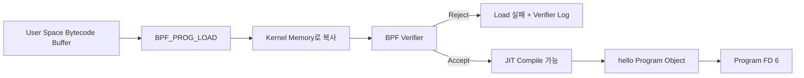

`expected_attach_type=BPF_CGROUP_INET_INGRESS`는 이 Program이 Cgroup Ingress에 Attach된다는 뜻이 아니다. `BPF_PROG_TYPE_KPROBE`에서는 이 Field가 의미 있게 사용되지 않으며, 0으로 초기화된 값이 `strace`에서 Enum의 첫 이름으로 표시된 것이다.

---

# 7. File Descriptor와 Kernel Object

Program과 Map을 생성하면 Kernel은 User Space에 File Descriptor를 반환한다.

| FD | 나타내는 Object |
|---:|---|
| `3` | BTF Data |
| `4` | `output` Perf Event Array Map |
| `5` | `config` Hash Map |
| `6` | `hello` eBPF Program |

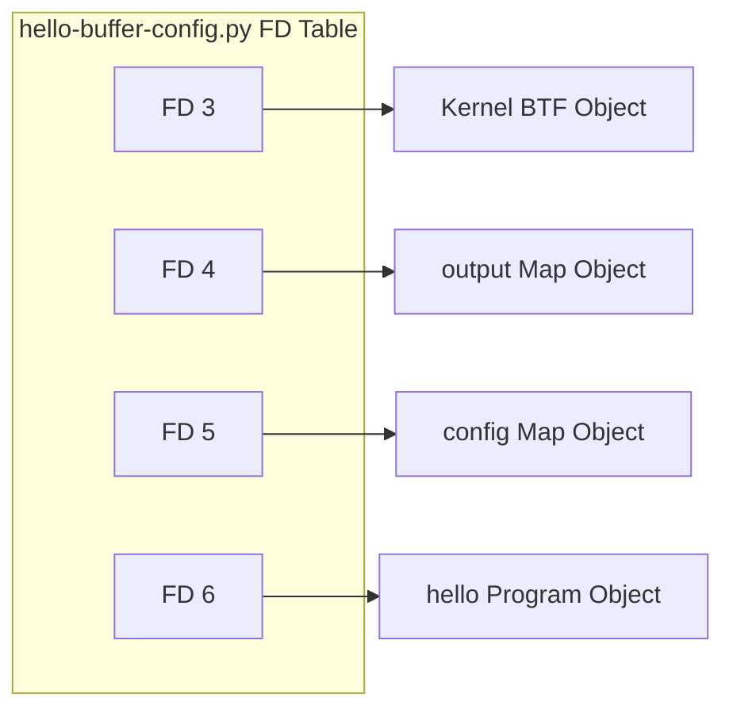

File Descriptor는 Process-local Handle이다. 같은 FD 번호가 다른 Process에서 동일한 Object를 뜻하지 않으며, 동일한 Kernel Object도 Process마다 다른 FD로 열릴 수 있다.

```text
Process A의 FD 5 → config Map
Process B의 FD 3 → 같은 config Map
```

반대로 다음도 가능하다.

```text
Process A의 FD 5 → config Map
Process B의 FD 5 → 일반 파일 또는 전혀 다른 BPF Map
```

---

# 8. User Space에서 Map 수정

Python 코드의 다음 줄은 일반 Dictionary 수정처럼 보이지만, 실제로는 Kernel BPF Map을 갱신한다.

```python
b["config"][ct.c_int(0)] = ct.create_string_buffer(b"Hey root!")
```

내부적으로 다음 System Call이 호출된다.

```text
bpf(BPF_MAP_UPDATE_ELEM, {
    map_fd=5,
    key=0xffffa7842490,
    value=0xffffa7a2b410,
    flags=BPF_ANY
}, 128) = 0
```

각 Field의 의미는 다음과 같다.

```text
map_fd=5
→ config Map

key
→ UID가 저장된 User Space Buffer 주소

value
→ Message가 저장된 User Space Buffer 주소

BPF_ANY
→ Key가 없으면 생성하고, 있으면 기존 Value 갱신
```

`key`와 `value`에 표시된 Hex 값은 UID나 문자열 값 자체가 아니라 User Space Memory 주소다.

Kernel은 `config` Map의 정의를 통해 Key가 4Byte, Value가 12Byte라는 사실을 알고 있다. 따라서 Key Buffer에서 4Byte, Value Buffer에서 12Byte를 복사해 Kernel Map Entry를 만든다.

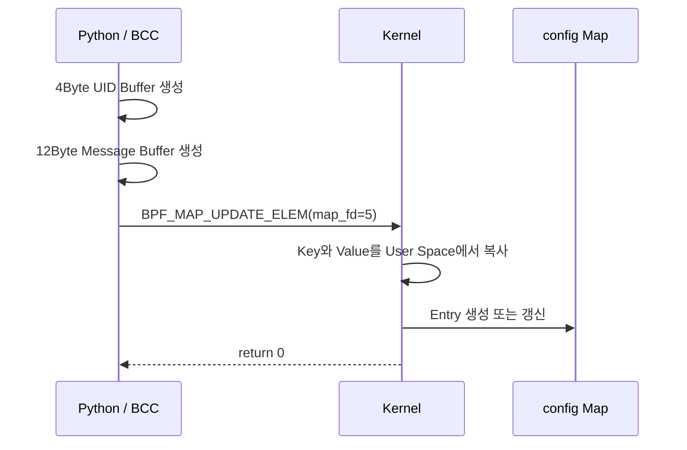

User Space에서는 `bpf()` System Call을 사용하지만, Kernel 안에서 실행되는 eBPF Program은 System Call을 사용하지 않는다.

```text
User Space
→ bpf(BPF_MAP_UPDATE_ELEM, ...)

Kernel eBPF Program
→ bpf_map_lookup_elem() Helper
```

---

# 9. BPF Program과 Map의 Reference Count

BPF Program과 Map은 Reference Count로 생명주기가 관리되는 Kernel Object다.

Program을 Load하면 Loader Process가 Program FD를 얻고, 이 FD가 Program에 대한 Reference 하나를 유지한다.

```text
Program FD 존재
→ Program 유지

Program FD Close
→ Reference Count 감소
```

Process가 종료되면 보유 중인 FD는 자동으로 닫힌다. 다른 Reference가 없다면 Reference Count가 0이 되고 Kernel이 Object를 제거한다.

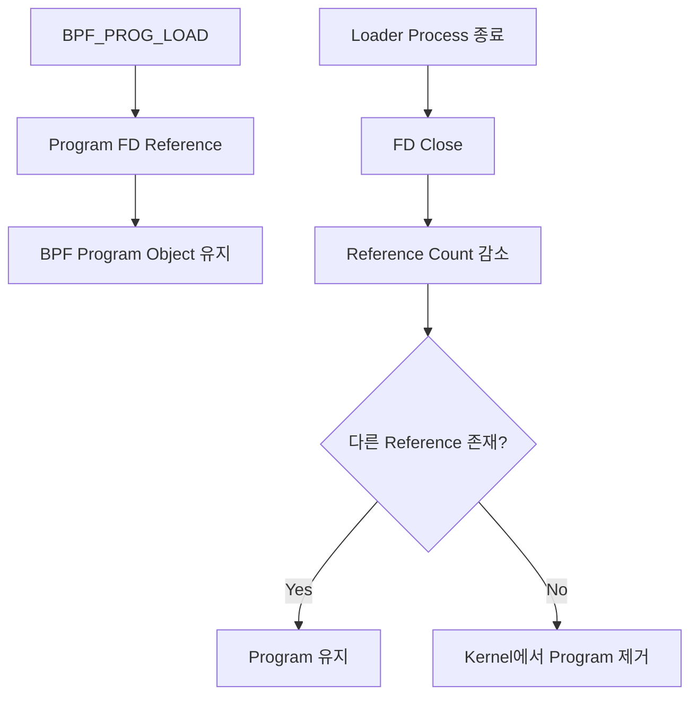

Map도 동일한 방식으로 관리된다.

Map에 대한 Reference는 다음과 같은 곳에서 생길 수 있다.

```text
User Space의 Map FD
eBPF Program의 Map 참조
bpffs Pin
다른 BPF Object의 참조
```

`hello` Program은 `config`와 `output` Map을 실제로 사용하므로 Program이 두 Map에 대한 Reference를 유지한다.

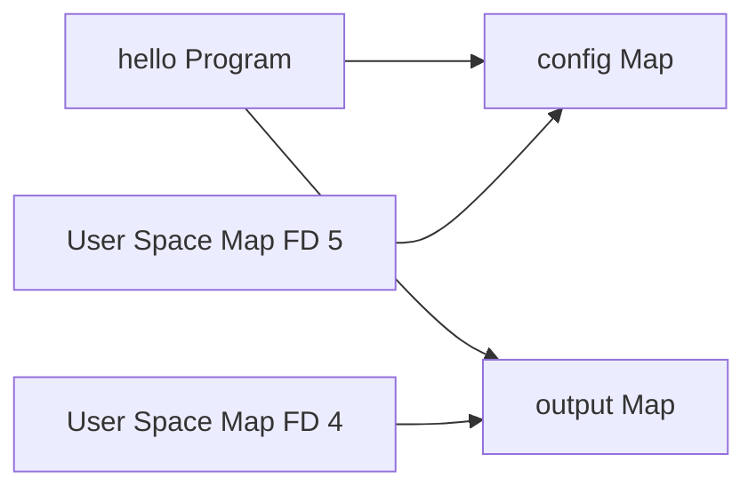

---

# 10. Pinning

다음 명령은 Program을 Load한 뒤 bpffs에 Pin한다.

```bash
bpftool prog load hello.bpf.o /sys/fs/bpf/hello
```

Pinning은 일반 디스크에 Bytecode 파일을 저장하는 작업이 아니다. `/sys/fs/bpf`는 BPF Object를 경로 형태로 노출하는 Pseudo Filesystem인 bpffs다.

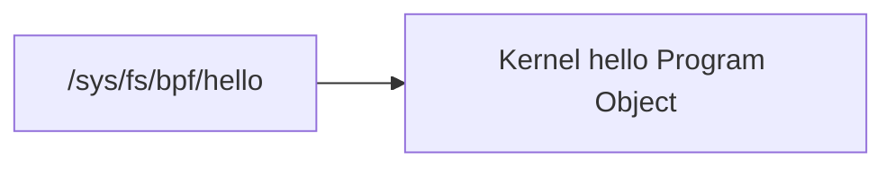

Pinning을 하지 않고 `bpftool`이 Program을 Load하기만 한다면, 명령 종료 시 Program FD가 닫히고 다른 Reference가 없을 경우 Program이 즉시 제거된다.

```text
Program Load
→ Program FD 획득
→ bpftool 종료
→ FD Close
→ Reference Count 0
→ Program 제거
```

Pinning을 하면 Path Reference가 추가된다.

```text
Program FD Reference + Pin Reference
```

따라서 Loader Process가 종료되어 FD Reference가 사라져도 Pin Reference가 남아 Program이 유지된다.

Pin된 Object는 Memory에 존재하므로 Reboot 이후까지 영구적으로 유지되는 것은 아니다. 재부팅 후에는 Agent나 Service가 Program을 다시 Load해야 한다.

---

# 11. BPF Links

BPF Link는 eBPF Program과 Hook 또는 Event 사이의 Attachment 관계를 별도의 Kernel Object로 표현한다.

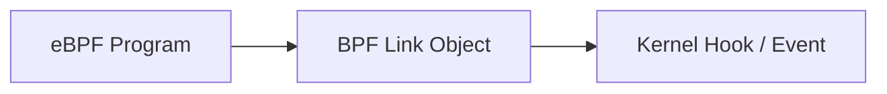

BPF Link도 FD를 가지며 bpffs에 Pin할 수 있다.

```text
Link FD 또는 Link Pin 존재
→ BPF Link 유지
→ Attachment 유지
→ Program Reference 유지
```

Program만 Pin하는 것과 Link를 Pin하는 것은 다르다.

| Pin 대상 | 유지되는 것 |
|---|---|
| Map | Map Object와 Map Data |
| Program | Program Object |
| BPF Link | Program과 Hook의 Attachment 관계 |

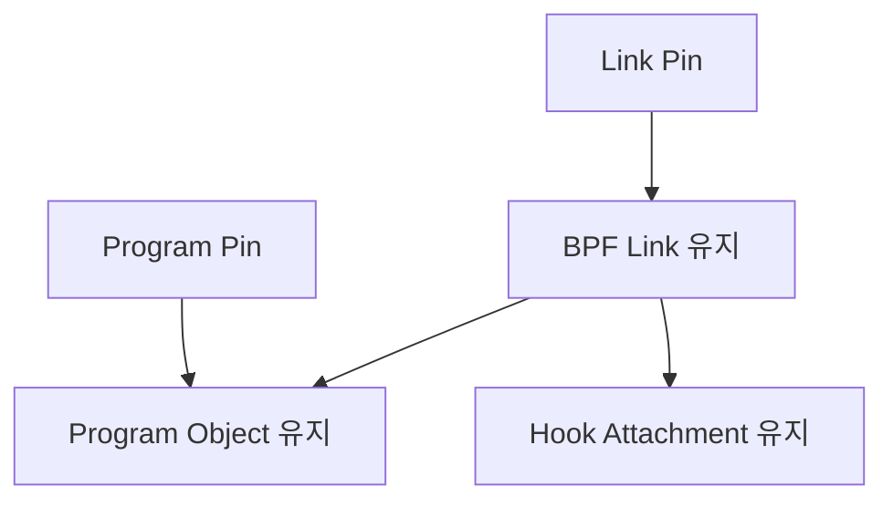

Program만 Pin하면 Program은 Kernel에 남지만 Hook에 Attach되어 있지 않다면 실행되지 않는다. Link를 Pin하면 Program과 Hook 사이의 연결 관계 자체가 유지된다.

---

# 12. Kprobe Event에 Program Attach

현재까지 `hello` Program은 Kernel에 Load되었지만 아직 `execve()` Event에 연결되지 않았다.

이번 BCC 예제의 Kprobe Attachment는 `bpf()`가 아니라 `perf_event_open()`과 `ioctl()`을 사용한다.

먼저 Kprobe Perf Event를 생성한다.

```text
perf_event_open({type=6, ...}, ...) = 7
```

실습 환경에서 다음 경로의 값이 6이므로 `type=6`은 Kprobe PMU를 의미한다.

```bash
cat /sys/bus/event_source/devices/kprobe/type
```

```text
6
```

반환된 FD 7은 `execve()` Kprobe Event를 나타낸다.

```text
FD 6 → hello Program
FD 7 → execve Kprobe Event
```

두 Object를 다음 `ioctl()`로 연결한다.

```text
ioctl(7, PERF_EVENT_IOC_SET_BPF, 6) = 0
```

그 후 Event를 활성화한다.

```text
ioctl(7, PERF_EVENT_IOC_ENABLE, 0) = 0
```

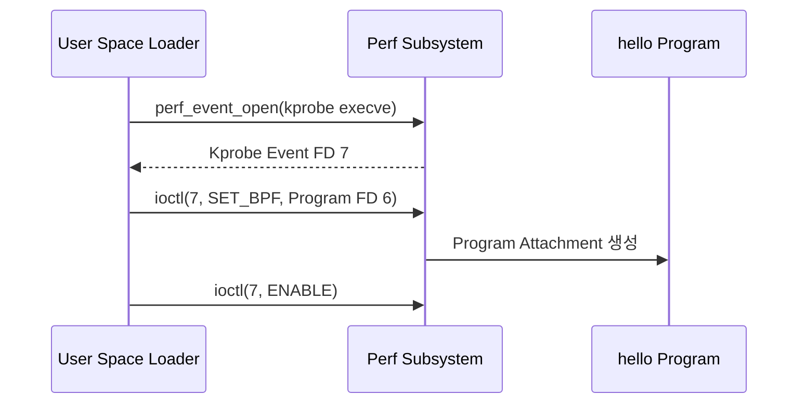

Runtime 흐름은 다음과 같다.


---

# 13. Perf Buffer 초기화

`output` Perf Event Array Map은 CPU별 Perf Output Event를 연결해야 한다.

CPU마다 다음 Sequence가 실행된다.

```text
perf_event_open({
    type=PERF_TYPE_SOFTWARE,
    config=PERF_COUNT_SW_BPF_OUTPUT,
    ...
}, -1, CPU_ID, -1, PERF_FLAG_FD_CLOEXEC) = PERF_FD

ioctl(PERF_FD, PERF_EVENT_IOC_ENABLE, 0) = 0

bpf(BPF_MAP_UPDATE_ELEM, {
    map_fd=4,
    key=&cpu_id,
    value=&perf_fd,
    flags=BPF_ANY
}, 128) = 0
```

실습 환경에는 CPU가 네 개 있으므로 다음 구성이 만들어진다.

| CPU | Perf Output FD | `output` Map Entry |
|---:|---:|---|
| 0 | 8 | `output[0] = FD 8` |
| 1 | 9 | `output[1] = FD 9` |
| 2 | 10 | `output[2] = FD 10` |
| 3 | 11 | `output[3] = FD 11` |

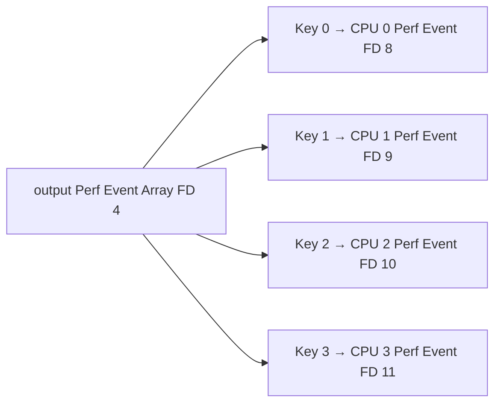

초기화 Sequence는 다음과 같다.

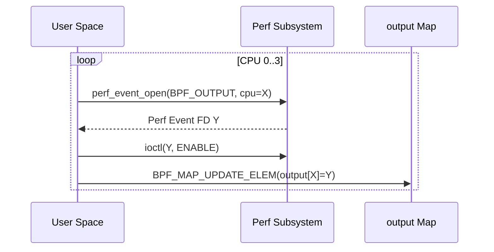

---

# 14. Perf Buffer Runtime과 `ppoll()`

eBPF Program이 CPU 2에서 실행되었다고 가정하면 다음 흐름으로 동작한다.

```text
hello() 실행
→ 현재 CPU 2 확인
→ output[2] 조회
→ CPU 2 Perf Buffer에 Event Record 작성
→ FD 10이 Readable 상태
→ User Space ppoll() Wakeup
```

User Space는 다음 네 FD를 동시에 기다린다.

```text
ppoll([
    {fd=8, events=POLLIN},
    {fd=9, events=POLLIN},
    {fd=10, events=POLLIN},
    {fd=11, events=POLLIN}
], 4, NULL, NULL, 0)
```

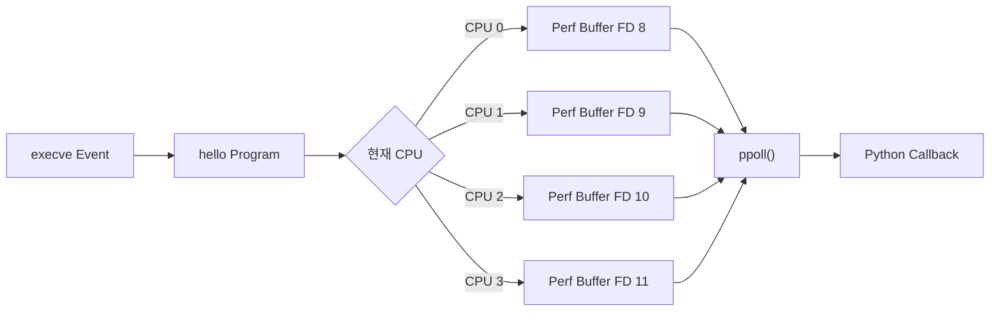

`ppoll()`은 실제 Event Payload를 반환하는 것이 아니라 어떤 FD에 읽을 데이터가 있는지 알려준다. 실제 Payload는 일반적으로 `mmap()`된 Perf Ring Buffer 영역에서 읽는다.

```text
ppoll()
→ Data 준비 여부 알림

mmap된 Perf Buffer
→ 실제 Event Record
```

따라서 Event를 읽을 때 `BPF_MAP_LOOKUP_ELEM`이 반복해서 호출되지 않는다. `output` Map은 Event 데이터를 직접 저장하는 일반 Map이 아니라 CPU별 Perf Event Channel을 연결하는 Map이기 때문이다.

---

# 15. Ring Buffer

Linux 5.8 이상에서는 Perf Buffer보다 BPF Ring Buffer가 선호된다. 주요 이유는 모든 CPU가 하나의 Shared Buffer를 사용하므로 Memory를 효율적으로 사용할 수 있고, 여러 CPU에서 제출된 Event의 순서를 보존하기 유리하기 때문이다.

## 15.1 코드 차이

| Perf Buffer | Ring Buffer |
|---|---|
| `BPF_PERF_OUTPUT(output);` | `BPF_RINGBUF_OUTPUT(output, 1);` |
| `output.perf_submit(ctx, &data, sizeof(data));` | `output.ringbuf_output(&data, sizeof(data), 0);` |
| `open_perf_buffer(print_event)` | `open_ring_buffer(print_event)` |
| `b.perf_buffer_poll()` | `b.ring_buffer_poll()` |

Ring Buffer Map은 다음과 같이 생성된다.

```text
bpf(BPF_MAP_CREATE, {
    map_type=BPF_MAP_TYPE_RINGBUF,
    key_size=0,
    value_size=0,
    max_entries=4096,
    map_name="output"
}, 128) = 4
```

`key_size=0`, `value_size=0`인 이유는 Ring Buffer가 Key-Value Map이 아니기 때문이다. Record가 순서대로 들어가며, Event마다 Payload 크기가 달라질 수 있다.

Ring Buffer에서 `max_entries=4096`은 Entry 개수가 아니라 전체 Buffer 크기 4096Byte를 의미한다.

## 15.2 Perf Buffer와 Ring Buffer 비교

| 구분 | Perf Buffer | BPF Ring Buffer |
|---|---|---|
| Buffer 구조 | CPU별 Buffer | 모든 CPU가 하나 공유 |
| Map Type | `PERF_EVENT_ARRAY` | `RINGBUF` |
| CPU별 Perf Event FD | 필요 | 불필요 |
| CPU별 Map Update | 필요 | 불필요 |
| CPU 간 Event Ordering | 복원이 어려움 | Shared Buffer 순서 보존에 유리 |
| User Space 대기 | 이 BCC 예제에서는 `ppoll()` | 이 BCC 예제에서는 `epoll` |
| 실제 Data 접근 | mmap된 Perf Buffer | mmap된 BPF Ring Buffer |

```mermaid
flowchart TB
    subgraph PERF["Perf Buffer"]
        P0["CPU 0"] --> PB0["Buffer 0"]
        P1["CPU 1"] --> PB1["Buffer 1"]
        P2["CPU 2"] --> PB2["Buffer 2"]
        P3["CPU 3"] --> PB3["Buffer 3"]
        PB0 --> PPOLL["ppoll()"]
        PB1 --> PPOLL
        PB2 --> PPOLL
        PB3 --> PPOLL
    end

    subgraph RING["BPF Ring Buffer"]
        R0["CPU 0"] --> RB["Shared Ring Buffer"]
        R1["CPU 1"] --> RB
        R2["CPU 2"] --> RB
        R3["CPU 3"] --> RB
        RB --> EPOLL["epoll_pwait()"]
    end
```

## 15.3 Event Ordering

Perf Buffer에서는 CPU마다 Buffer가 나뉘므로 실제 Event가 다음 순서로 발생해도,

```text
A(CPU 0) → B(CPU 1) → C(CPU 0)
```

User Space에서 Buffer를 읽는 순서에 따라 다음처럼 보일 수 있다.

```text
A → C → B
```

Ring Buffer는 하나의 Shared Buffer에 Record를 제출하므로 CPU 간 Event Ordering을 유지하기 유리하다.

다만 Ring Buffer가 시스템 전체의 모든 Event에 절대적인 시간 순서를 보장한다는 의미는 아니다. 동일한 Ring Buffer에 제출된 Record의 Reservation 및 Commit 순서를 유지하는 구조라고 이해해야 한다.

## 15.4 Ring Buffer Output Helper

```c
output.ringbuf_output(&data, sizeof(data), 0);
```

BCC는 이를 Ring Buffer Helper 호출로 변환한다.

```c
bpf_ringbuf_output(&output, &data, sizeof(data), 0);
```

보다 효율적인 방식으로 `reserve`와 `submit`을 사용할 수도 있다.

```c
struct data_t *event;

event = bpf_ringbuf_reserve(&output, sizeof(*event), 0);
if (!event)
    return 0;

event->pid = ...;
event->uid = ...;

bpf_ringbuf_submit(event, 0);
```

`bpf_ringbuf_reserve()`는 Ring Buffer 안에서 직접 공간을 확보하므로 Stack Buffer에서 다시 복사하는 작업을 줄일 수 있다.

---

# 16. Ring Buffer와 `epoll`

BCC의 Ring Buffer 구현은 `epoll`을 사용해 Data 도착을 기다린다.

먼저 Epoll Instance를 생성한다.

```text
epoll_create1(EPOLL_CLOEXEC) = 8
```

반환된 FD 8은 Ring Buffer가 아니라 Kernel Epoll Object를 가리킨다.

다음으로 Ring Buffer FD 4를 Epoll Set에 등록한다.

```text
epoll_ctl(
    8,
    EPOLL_CTL_ADD,
    4,
    {events=EPOLLIN, data={u32=0, u64=0}}
) = 0
```

이후 `epoll_pwait()`으로 Data를 기다린다.

```text
epoll_pwait(
    8,
    [{events=EPOLLIN, data={u32=0, u64=0}}],
    1,
    -1,
    NULL,
    8
) = 1
```

```mermaid
sequenceDiagram
    participant U as User Space
    participant E as Kernel Epoll Object
    participant R as Ring Buffer FD 4

    U->>E: epoll_create1()
    E-->>U: Epoll FD 8
    U->>E: epoll_ctl(ADD, Ring Buffer FD 4)
    U->>E: epoll_pwait()
    R->>E: EPOLLIN Event
    E-->>U: Ready Event 반환
```

`ppoll()`과 `epoll`의 차이는 FD 집합을 어디에서 관리하느냐에 있다.

```mermaid
flowchart TB
    subgraph PPOLL["ppoll"]
        U1["User Space FD 배열"] --> C1["매 호출마다 Kernel에 전달"]
        C1 --> W1["Event 대기"]
        W1 --> U1
    end

    subgraph EPOLL["epoll"]
        CREATE["epoll_create1"] --> SET["Kernel Epoll Set"]
        ADD["epoll_ctl로 FD 등록"] --> SET
        SET --> WAIT["epoll_pwait 반복"]
    end
```

`epoll_pwait()`도 실제 Payload를 반환하는 것은 아니다. Ring Buffer에 읽을 Data가 있다는 사실을 알려주며, 실제 Record는 `mmap()`된 Shared Ring Buffer에서 읽는다.

---

# 17. `bpftool`이 Map을 찾는 과정

다음 명령으로 `config` Map의 내용을 확인할 수 있다.

```bash
bpftool map dump name config
```

`bpftool`은 이름만으로 Map FD를 바로 얻는 것이 아니라, Kernel에 존재하는 Map ID를 순회하면서 각 Map의 Metadata를 확인한다.

```text
BPF_MAP_GET_NEXT_ID
→ 다음 Map ID 조회

BPF_MAP_GET_FD_BY_ID
→ Map ID를 현재 bpftool Process의 FD로 Open

BPF_OBJ_GET_INFO_BY_FD
→ Map Name과 Metadata 조회
```

대표적인 `strace` 흐름은 다음과 같다.

```text
bpf(BPF_MAP_GET_NEXT_ID, {start_id=0, ...}, 12) = 0
bpf(BPF_MAP_GET_FD_BY_ID, {map_id=48, ...}, 12) = 3
bpf(BPF_OBJ_GET_INFO_BY_FD, {info={bpf_fd=3, ...}}, 16) = 0
```

```mermaid
flowchart TD
    START["start_id=0"] --> NEXT["BPF_MAP_GET_NEXT_ID"]
    NEXT --> ID["다음 Map ID"]
    ID --> FD["BPF_MAP_GET_FD_BY_ID"]
    FD --> INFO["BPF_OBJ_GET_INFO_BY_FD"]
    INFO --> CHECK{"name == config?"}
    CHECK -->|No| CLOSE["FD Close 후 다음 ID"]
    CLOSE --> NEXT
    CHECK -->|Yes| KEEP["Map FD 유지"]
```

Map ID와 FD는 서로 다르다.

```text
Map ID
→ Kernel 전체에서 BPF Map Object를 식별

Map FD
→ 특정 Process가 해당 Map을 조작하기 위한 Handle
```

같은 Map이라도 Process마다 FD가 다를 수 있다.

```text
hello-buffer-config.py : config Map FD 5
bpftool               : 같은 config Map FD 3
```

---

# 18. Map Entry 순회

`bpftool`이 `config` Map의 FD를 얻은 뒤에는 다음 두 명령을 반복한다.

```text
BPF_MAP_GET_NEXT_KEY
→ 다음 유효한 Key 조회

BPF_MAP_LOOKUP_ELEM
→ 해당 Key의 Value 조회
```

첫 번째 Key를 요청할 때는 `key=NULL`을 사용한다.

```text
bpf(BPF_MAP_GET_NEXT_KEY, {
    map_fd=3,
    key=NULL,
    next_key=0xaaaaf7a63960
}, 24) = 0
```

Kernel은 첫 번째 Key를 `next_key`가 가리키는 User Space Buffer에 기록한다.

그 Key의 Value를 다음과 같이 조회한다.

```text
bpf(BPF_MAP_LOOKUP_ELEM, {
    map_fd=3,
    key=0xaaaaf7a63960,
    value=0xaaaaf7a63980
}, 32) = 0
```

```mermaid
flowchart TD
    FIRST["key=NULL"] --> NEXTKEY["BPF_MAP_GET_NEXT_KEY"]
    NEXTKEY --> KEY["다음 Key Buffer"]
    KEY --> LOOKUP["BPF_MAP_LOOKUP_ELEM"]
    LOOKUP --> VALUE["Value Buffer"]
    VALUE --> FORMAT["BTF로 Type 해석"]
    FORMAT --> PRINT["JSON 출력"]
    PRINT --> NEXTKEY
    NEXTKEY -->|ENOENT| END["Iteration 종료"]
```

실제 순서는 다음과 같다.

```text
key=NULL
→ 첫 Key 0

Lookup key 0
→ "Hey root!"

key=0
→ 다음 Key 501

Lookup key 501
→ "Hi user 501!"

key=501
→ 다음 Key 없음
→ ENOENT
```

마지막 `ENOENT`는 오류가 아니라 Map 순회 종료를 나타내는 정상적인 결과다.

`BPF_MAP_TYPE_HASH`의 순회 순서는 숫자 오름차순을 보장하지 않는다. 예제에서는 0, 501 순서로 출력되지만 Hash Map 내부 순서에 따라 501, 0으로 나타날 수도 있다.

또한 순회 중 다른 Program이나 Process가 Map을 수정할 수 있으므로 `BPF_MAP_GET_NEXT_KEY`와 `BPF_MAP_LOOKUP_ELEM`의 반복 결과는 원자적인 전체 Snapshot을 보장하지 않는다.

---

# 19. `bpftool`이 BTF를 이용해 출력하는 과정

Kernel이 Map Entry를 조회할 때 반환하는 것은 Raw Binary 데이터다.

```text
Key   : 4Byte
Value : 12Byte
```

`bpftool`은 Map에 연결된 BTF Metadata를 이용해 이를 다음처럼 해석한다.

```text
Key Type
→ u32
→ 0 또는 501

Value Type
→ struct user_msg_t
→ Field message
→ char[12]
```

그래서 다음과 같은 사람이 읽기 쉬운 JSON을 출력할 수 있다.

```json
[
  {
    "key": 0,
    "value": {
      "message": "Hey root!"
    }
  },
  {
    "key": 501,
    "value": {
      "message": "Hi user 501!"
    }
  }
]
```

---

# 20. Chapter 4 전체 흐름

이번 장에서 확인한 전체 흐름은 다음과 같다.

```mermaid
flowchart TD
    SOURCE["eBPF Source"] --> COMPILE["BCC / Clang·LLVM Compile"]
    COMPILE --> BTF["BTF Metadata"]
    COMPILE --> CODE["eBPF Bytecode"]

    BTF --> BTFLOAD["BPF_BTF_LOAD"]
    BTFLOAD --> BTFID["BTF FD 3"]

    CODE --> MAPCREATE["BPF_MAP_CREATE"]
    MAPCREATE --> OUTPUT["output Map FD 4"]
    MAPCREATE --> CONFIG["config Map FD 5"]

    CODE --> PROGLOAD["BPF_PROG_LOAD"]
    PROGLOAD --> VERIFY["Verifier"]
    VERIFY --> HELLO["hello Program FD 6"]

    CONFIG --> UPDATE["BPF_MAP_UPDATE_ELEM"]
    UPDATE --> CONFIGDATA["UID별 Message"]

    HELLO --> ATTACH["perf_event_open + ioctl"]
    ATTACH --> KPROBE["execve Kprobe FD 7"]

    KPROBE --> RUNTIME["execve Event"]
    RUNTIME --> HELLO

    HELLO --> CONFIG
    HELLO --> BUFFER["Perf Buffer 또는 Ring Buffer"]
    BUFFER --> WAIT["ppoll 또는 epoll"]
    WAIT --> CALLBACK["User Space Callback"]

    CONFIG --> TOOL["bpftool"]
    TOOL --> FIND["Map ID 순회"]
    FIND --> READ["Key / Value 순회"]
```

---

# 21. 핵심 정리

Chapter 4의 핵심은 `bpf()` System Call 하나를 외우는 것이 아니라, User Space Loader가 Kernel 안의 BPF Object를 어떤 순서로 구성하는지 이해하는 것이다.

첫째, `BPF_BTF_LOAD`는 Program과 Map의 Type Metadata를 Kernel에 등록하고 BTF FD를 반환한다.

둘째, `BPF_MAP_CREATE`는 실제 Kernel Map Object를 만들고 Map FD를 반환한다. 이번 예제에서는 UID별 설정을 저장하는 `config` Hash Map과 CPU별 Perf Event를 연결하는 `output` Perf Event Array Map을 생성한다.

셋째, `BPF_PROG_LOAD`는 User Space의 eBPF Bytecode를 Kernel로 복사하고 Verifier 검증을 수행한 뒤 Program Object와 Program FD를 만든다.

넷째, User Space는 `BPF_MAP_UPDATE_ELEM`을 이용해 Kernel Map을 수정하며, eBPF Program은 Helper Function을 이용해 Map을 조회한다.

다섯째, Program과 Map은 FD, Pin, Attachment, BPF Link 등의 Reference Count에 의해 생명주기가 관리된다. 마지막 Reference가 사라지면 Kernel은 Object를 제거한다.

여섯째, Kprobe Attachment는 이번 BCC 예제에서 `perf_event_open()`과 `ioctl()`을 이용해 구성된다. Program Load와 Program Attach는 서로 다른 단계다.

일곱째, Perf Buffer는 CPU마다 별도의 Output Event와 Buffer를 구성하며 User Space가 여러 FD를 `ppoll()`로 감시한다. BPF Ring Buffer는 모든 CPU가 하나의 Shared Buffer를 사용하고, 이 BCC 예제에서는 `epoll`로 Data 도착을 기다린다.

마지막으로 `bpftool`은 Kernel의 Map ID를 순회해 이름이 일치하는 Map을 찾고, Map FD를 얻은 뒤 `BPF_MAP_GET_NEXT_KEY`와 `BPF_MAP_LOOKUP_ELEM`을 반복하여 모든 Entry를 읽는다.

Chapter 4를 한 문장으로 정리하면 다음과 같다.

> eBPF Application은 User Space Loader가 `bpf()` 및 여러 Linux System Call을 사용해 BTF, Map, Program, Attachment, Buffer를 구성하고, Kernel 안의 eBPF Program이 Event에 반응해 실행되며, Map과 Buffer를 통해 User Space와 상태 및 Event 데이터를 교환하는 구조다.