# XCP-ng 구조 및 인프라: XOA, OpenStack, VMware 비교

이번 인프라 스터디 주제는 **XCP-ng 구조 및 인프라, XOA 서버와 XOA 라이선스**이다.

처음에는 XCP-ng라는 이름부터 생소했고, XCP-ng와 XOA가 같은 제품인지도 헷갈렸다. 그런데 내가 접하고 있는 OpenStack과 비교해 보니 전체 구조가 조금 더 쉽게 보였다.

아주 간단하게 먼저 정리하면 다음과 같다.

```text
XCP-ng
= 물리 서버에 설치하여 VM을 실행하는 가상화 플랫폼

XOA
= XCP-ng Host와 VM을 웹에서 중앙 관리하는 관리 서버

OpenStack
= 컴퓨트, 네트워크, 스토리지, 이미지, 인증을 서비스 형태로 제공하는 클라우드 플랫폼

VMware ESXi
= XCP-ng와 비슷한 역할의 상용 가상화 플랫폼

VMware vCenter
= XOA와 비슷한 역할의 중앙 관리 플랫폼
```

이 글에서는 가상화의 기본 개념부터 XCP-ng 전체 구조, XOA 서버와 라이선스, OpenStack 및 VMware와의 차이를 순서대로 정리한다.

---

## 1. 가상화란 무엇인가?

### 1-1) 물리 서버를 그대로 사용하는 경우

가상화를 사용하지 않으면 일반적으로 물리 서버 한 대에 운영체제 하나를 설치한다.

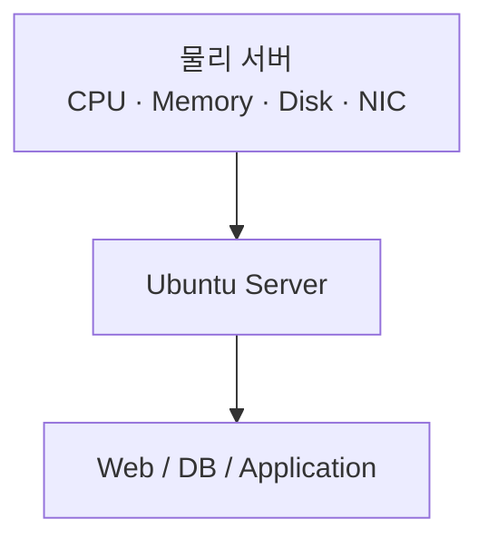

예를 들어 웹 서버, 데이터베이스 서버, 모니터링 서버를 각각 분리하려면 물리 서버를 여러 대 준비할 수 있다.

```text
물리 서버 1 → Web Server
물리 서버 2 → Database Server
물리 서버 3 → Monitoring Server
```

이 방식은 단순하지만 각 서버의 자원 사용률이 낮으면 CPU와 메모리가 낭비될 수 있다. 새로운 서버가 필요할 때마다 장비 구매, 랙 설치, 네트워크 연결도 필요하다.

### 1-2) 가상화를 사용하는 경우

가상화를 적용하면 물리 서버 한 대의 자원을 여러 가상머신이 나누어 사용할 수 있다.

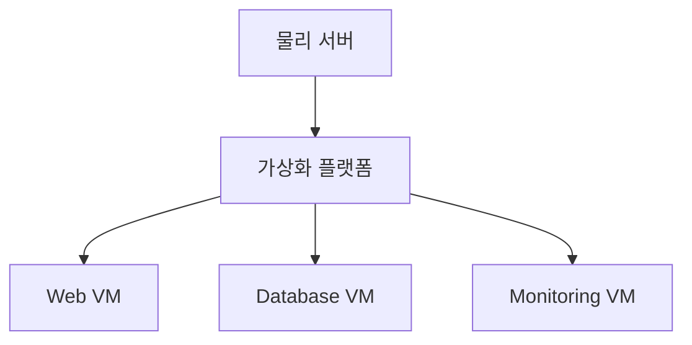

각 VM에는 독립적인 운영체제를 설치할 수 있다.

```text
Web VM        → Ubuntu
Database VM   → Rocky Linux
Monitoring VM → Debian
```

여기서 VM은 **Virtual Machine**, 즉 가상머신을 의미한다.

### 1-3) 하이퍼바이저란?

하이퍼바이저는 물리 서버의 CPU, 메모리, 디스크, 네트워크 자원을 여러 VM에 나누어 주고, 각 VM이 서로 분리되어 실행되도록 관리하는 계층이다.

```text
물리 CPU    → VM에 vCPU로 할당
물리 Memory → VM에 가상 메모리로 할당
물리 Disk   → VM에 가상 디스크로 제공
물리 NIC    → VM에 가상 NIC로 제공
```

XCP-ng에서는 **Xen Hypervisor**가 이 핵심 역할을 수행한다.

---

## 2. XCP-ng란 무엇인가?

XCP-ng는 **Xen Hypervisor를 기반으로 만들어진 오픈소스 서버 가상화 플랫폼**이다.

물리 서버에 XCP-ng를 설치하면 그 서버는 여러 VM을 실행하는 가상화 Host가 된다.

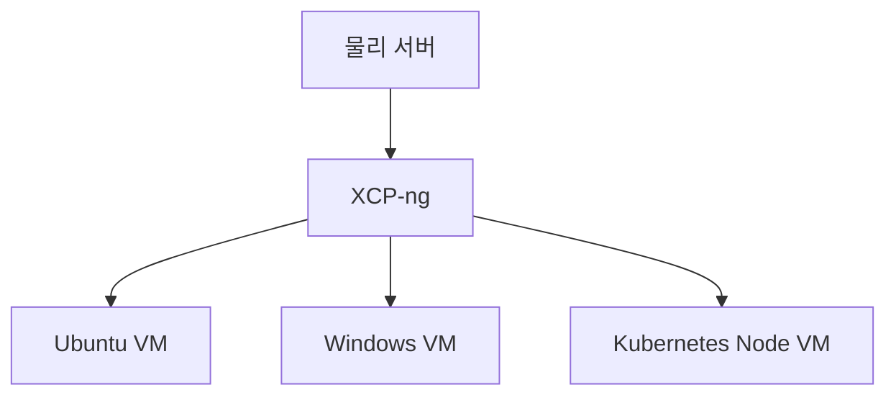

XCP-ng는 ISO 이미지로 배포되며 물리 서버에 직접 설치하는 Bare-metal 방식의 플랫폼이다.

쉽게 말하면 다음과 같다.

> XCP-ng는 물리 서버 한 대를 여러 대의 가상 서버처럼 사용할 수 있게 만드는 오픈소스 가상화 플랫폼이다.

### 2-1) Xen과 XCP-ng의 관계

Xen은 실제로 CPU와 메모리를 가상화하고 VM을 실행하는 핵심 하이퍼바이저이다.

XCP-ng는 Xen만 단독으로 제공하는 것이 아니라 다음 요소를 함께 묶은 완성형 플랫폼이다.

- Xen Hypervisor
- VM 관리 기능
- Host 관리 기능
- Storage 관리
- Network 관리
- XAPI
- Pool 관리
- Xen Orchestra 연동

따라서 관계는 다음처럼 이해하면 된다.

```text
Xen
= 실제 가상화를 수행하는 핵심 엔진

XCP-ng
= Xen을 포함하고 관리 기능까지 통합한 가상화 플랫폼
```

### 2-2) XCP-ng Host란?

XCP-ng가 설치된 물리 서버를 **XCP-ng Host**라고 한다.

```text
XCP-ng Host
├── CPU
├── Memory
├── Disk
├── Network Interface
├── Xen Hypervisor
└── 여러 VM
```

VM은 Host의 CPU, 메모리, 디스크, 네트워크 자원을 나누어 사용한다.

---

## 3. XCP-ng Host 내부 구조

XCP-ng Host 구조를 단순화하면 다음과 같다.

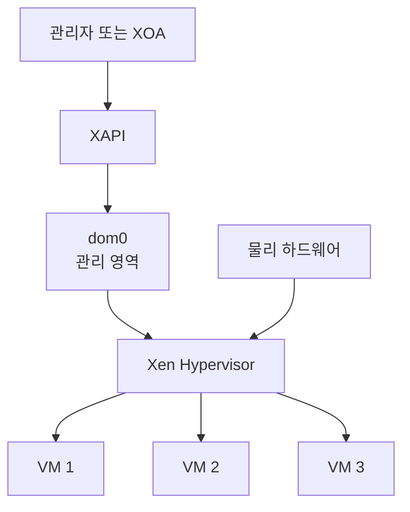

### 3-1) Xen Hypervisor

Xen Hypervisor는 물리 서버 위에서 VM의 CPU와 메모리를 관리한다.

주요 역할은 다음과 같다.

- VM에 CPU 시간 할당
- VM에 메모리 할당
- VM 간 자원 격리
- VM 실행과 중지
- 하드웨어 가상화 기능 사용

### 3-2) dom0

`dom0`는 XCP-ng Host를 관리하는 특권 영역이다.

처음 공부할 때는 다음 정도로 이해하면 충분하다.

```text
Xen Hypervisor
= VM이 실제로 실행되도록 자원을 관리

dom0
= Xen과 VM, 스토리지, 네트워크를 관리하는 제어 영역

일반 VM
= 실제 서비스가 실행되는 사용자 가상머신
```

dom0는 일반적인 서비스 운영용 VM이 아니다. XCP-ng Host를 제어하기 위한 관리 영역이므로, 여기에 임의의 애플리케이션을 설치해 운영하는 것은 권장되지 않는다.

### 3-3) XAPI

XCP-ng는 **XAPI**를 중심으로 관리된다.

관리자가 VM 생성, 종료, 삭제, 스토리지 연결 등의 작업을 요청하면 XAPI가 해당 작업을 처리한다.

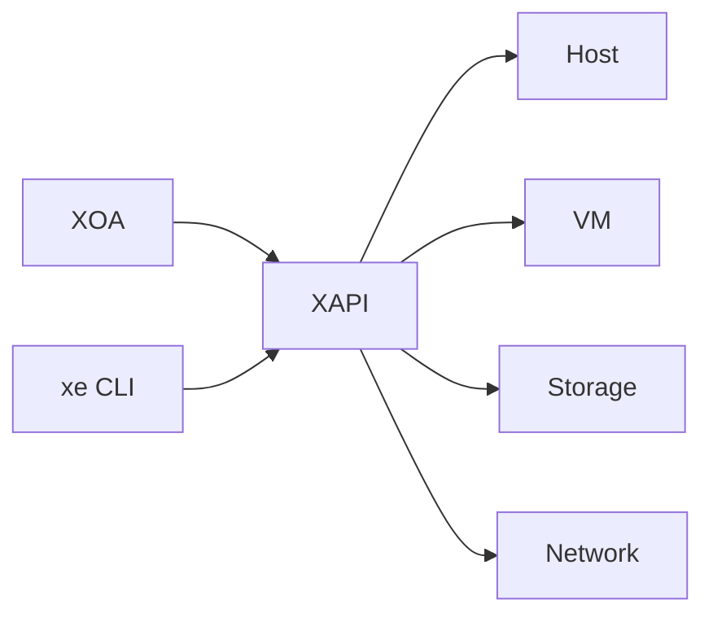

XOA가 Xen Hypervisor를 직접 조작하는 것이 아니라, XAPI를 통해 XCP-ng Host와 Pool을 관리한다.

---

## 4. XCP-ng Pool 구조

XCP-ng Host는 한 대만 독립적으로 사용할 수도 있지만, 여러 Host를 하나의 **Pool**로 묶을 수 있다.

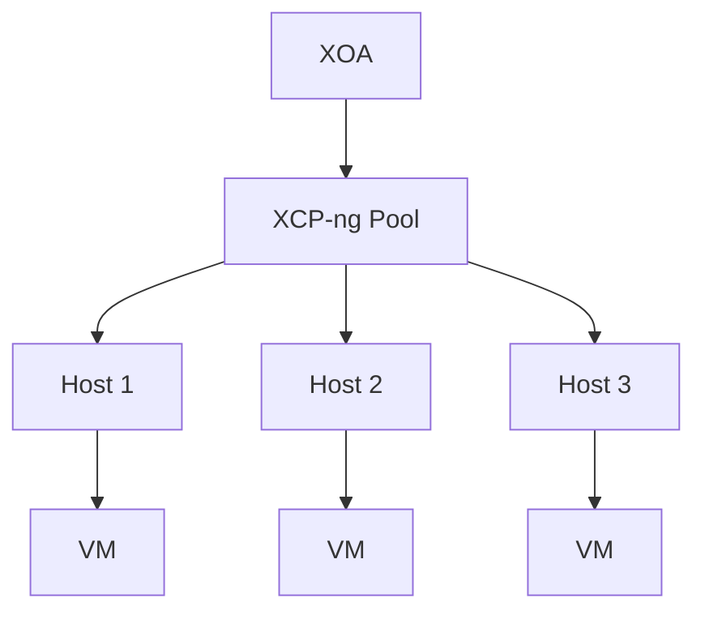

Pool을 사용하면 여러 Host를 하나의 관리 단위처럼 운영할 수 있다.

주요 장점은 다음과 같다.

- 여러 Host 중앙 관리
- VM을 다른 Host로 이동
- 공유 스토리지 사용
- Host 유지보수
- HA 구성
- 자원 분산

다만 Pool로 묶었다고 자동으로 모든 VM이 고가용성을 가지는 것은 아니다. 공유 스토리지, 네트워크, HA 설정이 함께 필요하다.

---

## 5. XCP-ng의 스토리지 구조

XCP-ng에서 VM 디스크가 저장되는 공간을 **Storage Repository, SR**이라고 한다.

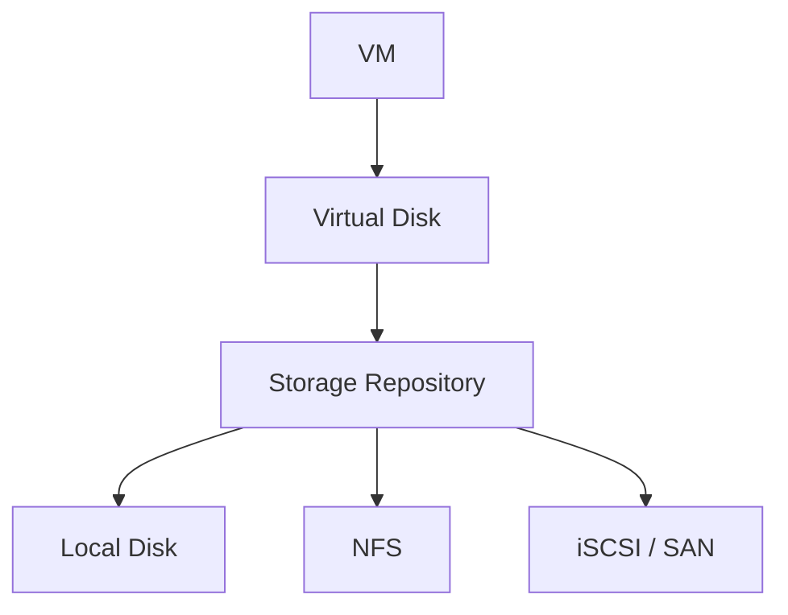

SR은 크게 로컬 스토리지와 공유 스토리지로 나눌 수 있다.

### 5-1) Local SR

특정 XCP-ng Host의 로컬 디스크를 사용하는 방식이다.

```text
Host 1 Local SR
└── Host 1에서 사용하는 VM 디스크
```

구성이 단순하지만, 다른 Host가 해당 디스크에 직접 접근하기 어렵기 때문에 Migration이나 HA 구성에 제약이 생길 수 있다.

### 5-2) Shared SR

여러 Host가 함께 접근할 수 있는 공유 스토리지이다.

```text
Host 1 ─┐
Host 2 ─┼─ Shared SR
Host 3 ─┘
```

NFS, iSCSI, SAN 등의 스토리지를 사용할 수 있다.

공유 스토리지가 있으면 VM 디스크는 그대로 둔 채 실행 Host만 변경하는 구성이 쉬워진다.

---

## 6. XCP-ng 네트워크 구조

XCP-ng에서는 물리 NIC와 가상 네트워크를 연결하여 VM에 네트워크를 제공한다.

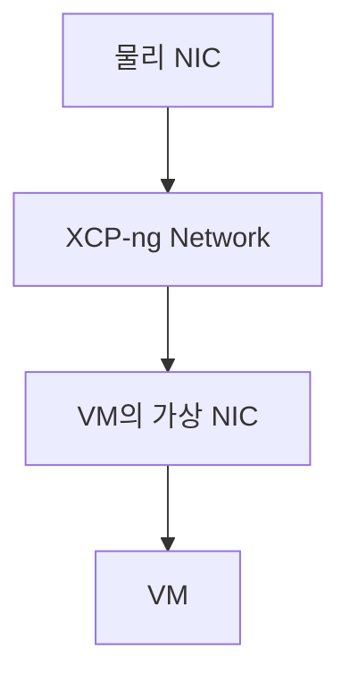

실제 운영에서는 네트워크를 목적별로 분리할 수 있다.

```text
Management Network
→ Host와 XOA 관리 통신

VM Network
→ VM 서비스 트래픽

Storage Network
→ NFS, iSCSI 등 스토리지 통신

Migration Network
→ VM 이동에 사용하는 트래픽
```

XCP-ng는 VLAN과 NIC Bonding 같은 기능도 지원한다.

---

## 7. XOA란 무엇인가?

XOA는 **Xen Orchestra Appliance**의 약자이다.

Xen Orchestra는 XCP-ng Host와 VM을 중앙 관리하는 소프트웨어이고, XOA는 Vates가 설치와 업데이트, 지원이 가능한 Appliance 형태로 제공하는 공식 배포판이다.

```text
Xen Orchestra
= XCP-ng 관리 소프트웨어

XOA
= 공식적으로 패키징된 Xen Orchestra Appliance
```

### 7-1) XOA가 필요한 이유

XOA가 없더라도 CLI나 다른 관리 도구로 XCP-ng Host를 관리할 수 있다. 하지만 Host가 여러 대이고 VM이 많아지면 중앙 관리 도구가 필요하다.

XOA는 다음 기능을 제공한다.

- Host와 Pool 관리
- VM 생성, 시작, 종료, 삭제
- Snapshot
- VM Migration
- Backup과 Restore
- Replication
- Monitoring과 Report
- 사용자 및 권한 관리
- API와 자동화

### 7-2) XOA 서버 구조

XOA는 보통 VM 형태로 배포한다.

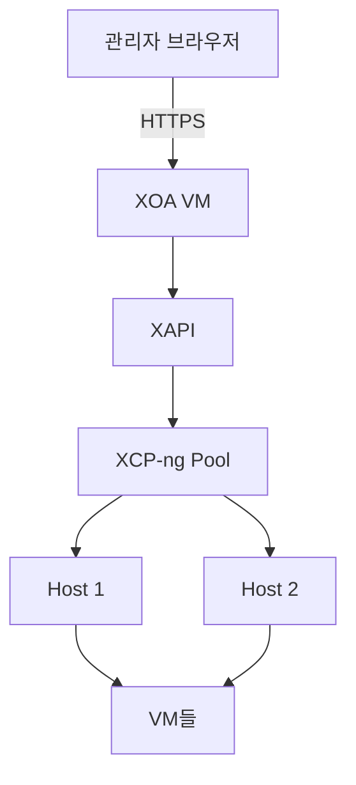

관리자는 브라우저에서 XOA의 IP 주소로 접속한다.

```text
관리자
↓ HTTPS
XOA
↓ XAPI
XCP-ng Pool
↓
Host와 VM 관리
```

### 7-3) XOA가 Pool 내부에 있으면 생길 수 있는 문제

XOA를 관리 대상 Pool 안의 VM으로 실행하는 것은 일반적인 구성이지만, Pool 전체 장애가 발생하면 XOA도 함께 중단될 수 있다.

따라서 운영 환경에서는 다음을 고려해야 한다.

- XOA VM 백업
- XOA 설정 백업
- XOA 복구 절차
- 관리 네트워크 분리
- 필요하면 별도 관리 인프라에 XOA 배치

---

## 8. XOA와 Xen Orchestra Community 버전

Xen Orchestra는 오픈소스로 제공된다.

사용 방식은 크게 두 가지로 나눌 수 있다.

| 구분 | XO from Sources | XOA |
|---|---|---|
| 설치 방식 | GitHub 소스에서 직접 설치 | 공식 Appliance 배포 |
| 비용 | 무료 사용 가능 | 상용 구독에 포함 |
| 업데이트 | 직접 관리 | 공식 Updater 제공 |
| QA 및 안정 버전 | 직접 검증 필요 | Vates가 테스트 및 유지관리 |
| 기술지원 | Community | 공식 지원 |
| 추천 환경 | 홈랩, 테스트, 학습 | 운영 환경 |

중요한 점은 **오픈소스 버전이라고 기능이 단순히 잠기는 구조는 아니라는 것**이다. 차이는 주로 공식 패키징, 검증, 업데이트 편의성, SLA와 기술지원에 있다.

---

## 9. XOA 라이선스와 현재 Vates VMS 구독

XCP-ng와 Xen Orchestra는 오픈소스이며 무료로 다운로드하여 실행할 수 있다.

현재 Vates의 상용 모델은 소프트웨어 기능을 해제하는 단순 라이선스라기보다 다음 항목을 묶은 **Vates VMS 지원 구독**에 가깝다.

- XCP-ng 공식 지원
- Xen Orchestra Appliance 1대
- 기술지원 티켓
- SLA
- 업데이트 및 업그레이드 지원
- 상위 플랜의 전체 기능 접근

### 9-1) 기존 XOA Starter와 Enterprise 구독 종료

과거에는 XOA Starter, Enterprise 같은 Xen Orchestra 단독 구독이 있었다.

하지만 Vates는 기존 Starter와 Enterprise 단독 구독을 **2026년 7월 31일 종료**하고, XCP-ng와 XOA 지원을 묶은 Vates VMS 모델로 전환했다.

따라서 2026년 8월 현재 라이선스를 설명할 때 과거의 Starter, Enterprise만 기준으로 설명하면 최신 구조와 맞지 않는다.

### 9-2) 현재 Vates VMS 구독 단계

2026년 8월 공식 가격 페이지 기준으로 주요 구독은 다음과 같다.

| 구독 | Host 기준 | 지원 형태 | 주요 특징 |
|---|---:|---|---|
| Essential | 최대 3 Hosts | 업무일 지원, 연 6개 티켓 | 소규모 표준 환경 |
| Essential+ | 최대 3 Hosts | 업무일 지원, 무제한 티켓 | 전체 기능 접근 |
| Pro | 최소 3 Hosts | 업무일 지원, 무제한 티켓 | 중·대규모 환경 |
| Enterprise | 최소 4 Hosts | 24/7 지원 | 중요 운영 환경, 전체 기능 접근 |

모든 단계에는 구독 Host의 XCP-ng 지원과 Xen Orchestra Appliance 1대가 포함된다.

공식 페이지에 표시된 연간 정가는 다음과 같지만 계약 기간, 통화, 세금, 견적 조건에 따라 달라질 수 있다.

```text
Essential   → 연 2,000달러 또는 유로, 최대 3 Hosts
Essential+  → 연 4,000달러 또는 유로, 최대 3 Hosts
Pro         → Host당 연 1,000달러 또는 유로, 최소 3 Hosts
Enterprise  → Host당 연 1,800달러 또는 유로, 최소 4 Hosts
```

가격은 변경될 수 있으므로 실제 도입 시점에는 공식 견적을 다시 확인해야 한다.

### 9-3) 라이선스에서 가장 중요한 점

```text
XCP-ng와 Xen Orchestra
= 오픈소스로 무료 사용 가능

Vates VMS 구독
= 공식 XOA, 기술지원, SLA, 유지관리 서비스를 구매
```

즉, 구독하지 않았다고 XCP-ng 자체가 실행되지 않는 구조는 아니다.

---

## 10. OpenStack과 XCP-ng 비교

OpenStack과 XCP-ng는 둘 다 VM을 제공할 수 있지만 같은 종류의 플랫폼은 아니다.

```text
XCP-ng
= 가상화 플랫폼

OpenStack
= IaaS 클라우드 플랫폼
```

### 10-1) 전체 구조 비교

#### OpenStack

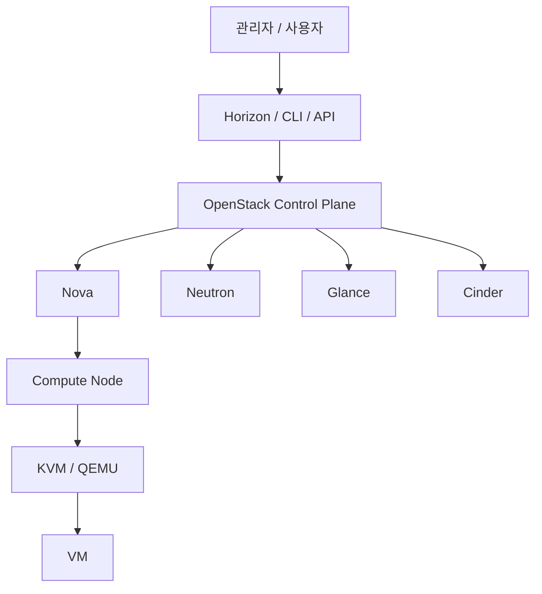

#### XCP-ng

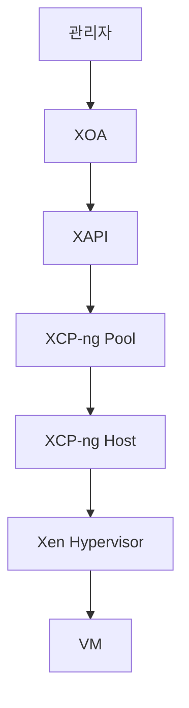

OpenStack은 Nova, Neutron, Glance, Cinder, Keystone 같은 여러 서비스가 역할을 분담한다. XCP-ng는 XAPI와 Xen을 중심으로 VM, 스토리지, 네트워크를 비교적 통합된 구조로 관리한다.

### 10-2) 구성 요소 비교

아래 비교는 이해를 돕기 위한 기능상 대응이며, 내부 구조가 동일하다는 의미는 아니다.

| OpenStack | XCP-ng / XOA | 역할 |
|---|---|---|
| Horizon | XOA Web UI | 웹 관리 화면 |
| Compute Node | XCP-ng Host | VM이 실행되는 물리 서버 |
| KVM/QEMU | Xen Hypervisor | 실제 가상화 수행 |
| Nova | XAPI 및 XCP-ng 관리 계층 | VM 생명주기 관리 |
| Glance Image | ISO, Template | VM 설치 및 배포 원본 |
| Cinder Backend | Storage Repository | VM 디스크 저장 공간 |
| Neutron Network | XCP-ng Network | VM 논리 네트워크 |
| Keystone/RBAC | XOA 사용자 및 ACL | 사용자와 권한 관리 |
| 여러 Compute Node | XCP-ng Pool | 여러 Host 관리 |

### 10-3) Horizon과 XOA 차이

Horizon은 OpenStack API를 조작하는 웹 대시보드이다. 실제 VM 생성은 Nova가, 네트워크는 Neutron이, 볼륨은 Cinder가 처리한다.

XOA는 웹 UI이면서 다음 운영 기능을 함께 제공한다.

- Host와 Pool 관리
- VM 관리
- Backup과 Restore
- Replication
- Monitoring
- ACL
- 자동화

따라서 XOA를 Horizon과 비교할 수는 있지만, XOA의 기능 범위가 더 넓다.

### 10-4) 언제 OpenStack이 더 적합한가?

다음 요구사항이 중요하면 OpenStack이 더 적합할 수 있다.

- 여러 프로젝트와 Tenant
- 사용자 Self-Service
- 복잡한 가상 네트워크
- Floating IP와 Router
- API 기반 클라우드 제공
- Compute, Network, Storage를 독립 서비스로 확장
- 대규모 프라이빗 클라우드

### 10-5) 언제 XCP-ng가 더 적합한가?

다음과 같은 경우 XCP-ng가 더 단순할 수 있다.

- 서버 가상화가 주요 목적
- 관리자가 중앙에서 VM 운영
- VMware 대체 플랫폼 검토
- 비교적 단순한 사내 가상화 환경
- XOA 기반 VM 백업과 복구 필요
- OpenStack 수준의 멀티테넌트 기능이 필요하지 않음

---

## 11. VMware와 XCP-ng 비교

XCP-ng는 구조적으로 OpenStack보다 VMware 환경과 더 직접적으로 비교하기 쉽다.

| VMware | XCP-ng | 역할 |
|---|---|---|
| ESXi | XCP-ng | 물리 서버에 설치되는 가상화 플랫폼 |
| ESXi Host | XCP-ng Host | VM 실행 Host |
| vCenter Server | XOA | 여러 Host 중앙 관리 |
| vSphere Client | Xen Orchestra Web UI | 웹 관리 화면 |
| Datastore | Storage Repository | VM 디스크 저장 공간 |
| vMotion | Live Migration | 실행 Host 이동 |
| Snapshot | Snapshot | VM 시점 상태 관리 |
| VM Template | VM Template | VM 배포 원본 |

### 11-1) 구조 비교

#### VMware

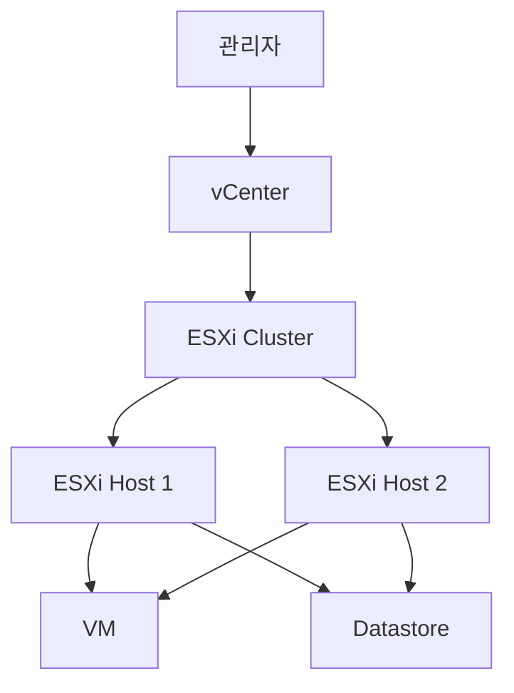

#### XCP-ng

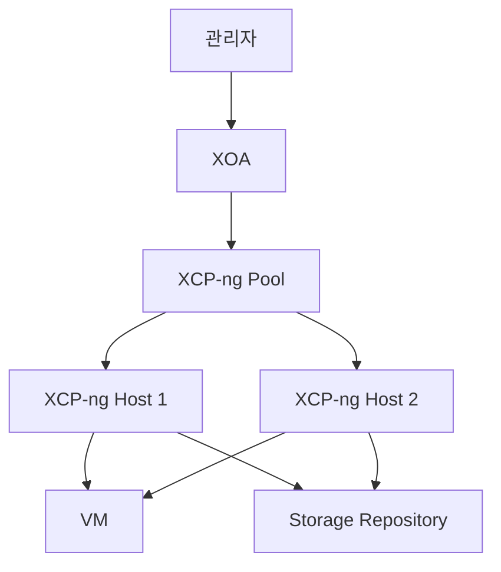

### 11-2) 주요 차이

| 구분 | VMware | XCP-ng |
|---|---|---|
| 핵심 Hypervisor | VMware ESXi Hypervisor | Xen Hypervisor |
| 중앙 관리 | vCenter | XOA |
| 라이선스 | 상용 라이선스 중심 | 오픈소스 + 선택적 지원 구독 |
| 관리 생태계 | 대규모 상용 생태계 | Vates 및 오픈소스 생태계 |
| 백업 | 별도 제품과 연동하는 경우 많음 | Xen Orchestra에 백업 기능 포함 |
| 도입 난이도 | 기능이 풍부하지만 비용과 설계 고려 | 비교적 단순한 통합 구조 |
| 기술지원 | VMware 지원 체계 | Vates 지원 구독 |

XCP-ng를 VMware와 비교할 때는 단순히 “무료 VMware”라고 표현하기보다 다음과 같이 설명하는 것이 정확하다.

> XCP-ng는 VMware ESXi와 비슷한 서버 가상화 역할을 수행하지만, Xen Hypervisor와 XAPI를 기반으로 하는 별도의 오픈소스 플랫폼이다.

---

## 12. 실제 XCP-ng 구축 예시

물리 서버 3대와 공유 스토리지, XOA를 사용하는 환경을 가정할 수 있다.

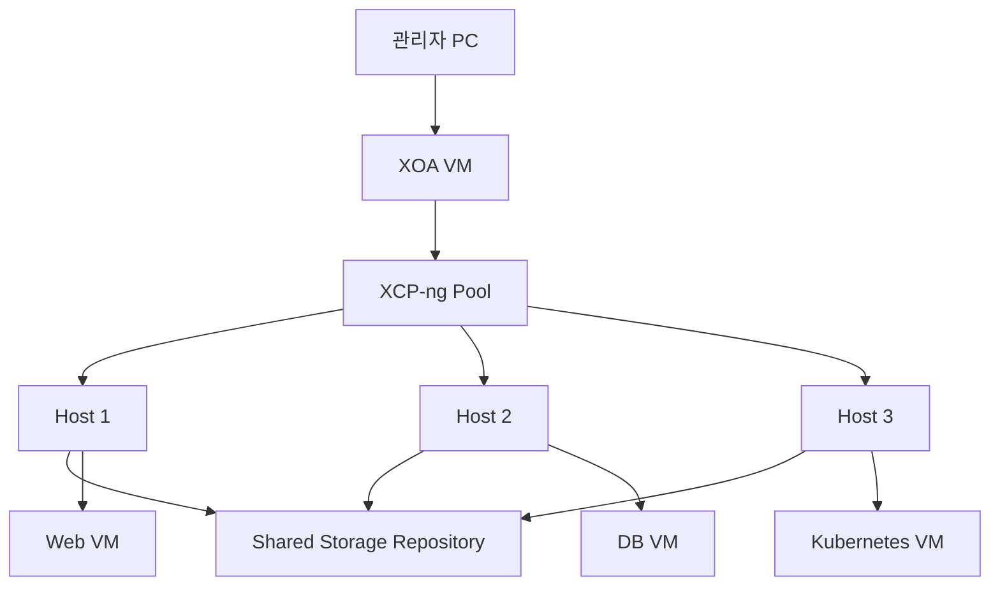

### 구성 요소

```text
XOA VM
→ 전체 Pool과 VM 중앙 관리

XCP-ng Host 1~3
→ 실제 VM 실행

Shared SR
→ 여러 Host가 공유하는 VM 디스크 저장소

Management Network
→ XOA와 Host 관리 통신

VM Network
→ 서비스 트래픽

Storage Network
→ Host와 Shared SR 통신
```

### 장애가 발생하면

Host 2가 장애를 일으켰다고 가정해 보자.

- Host 2에서 실행 중인 VM은 중단될 수 있다.
- HA가 구성되어 있으면 정상 Host에서 VM 재시작을 시도할 수 있다.
- Shared SR을 사용하면 다른 Host가 같은 VM 디스크에 접근할 수 있다.
- XOA가 정상이라면 장애 확인과 복구 작업을 중앙에서 수행할 수 있다.

여기서 HA는 VM을 무중단으로 계속 실행시키는 기능이라기보다, 장애 Host에서 실행되던 VM을 정상 Host에서 자동으로 다시 부팅하는 개념에 가깝다.

---

## 13. 전체 내용 정리

### XCP-ng

```text
물리 서버에 설치
↓
Xen Hypervisor로 VM 실행
↓
XAPI로 Host, VM, Storage, Network 관리
```

### XOA

```text
웹 기반 중앙 관리 서버
↓
XAPI와 통신
↓
여러 XCP-ng Host와 VM 관리
↓
Backup, Restore, Monitoring 제공
```

### OpenStack과 차이

```text
XCP-ng
= 서버 가상화 플랫폼

OpenStack
= Compute, Network, Storage, Image, Identity를 제공하는 클라우드 플랫폼
```

### VMware와 대응

```text
VMware ESXi ↔ XCP-ng
vCenter     ↔ XOA
Cluster     ↔ Pool
Datastore   ↔ Storage Repository
vMotion     ↔ Live Migration
```

### 라이선스

```text
XCP-ng와 Xen Orchestra
= 오픈소스로 무료 사용 가능

Vates VMS
= 공식 XOA, 기술지원, SLA를 포함하는 상용 구독
```

---

## 14. 요약
- XCP-ng는 물리 서버에 설치하여 여러 가상머신을 실행하는 Xen 기반 오픈소스 가상화 플랫폼
- Xen Hypervisor가 CPU와 메모리 같은 물리 자원을 VM에 분배하고, XAPI가 Host, VM, 스토리지, 네트워크를 관리
- 여러 XCP-ng Host는 Pool로 묶어 관리할 수 있으며, VM 디스크는 Storage Repository에 저장됨
- XOA는 Xen Orchestra Appliance의 약자로, 여러 XCP-ng Host와 VM을 웹에서 중앙 관리하고 백업, 복구, 모니터링 기능을 제공
- OpenStack과 비교하면 XCP-ng는 가상화 플랫폼이고 OpenStack은 여러 인프라 기능을 서비스로 제공하는 클라우드 플랫폼
- VMware 환경에서는 XCP-ng가 ESXi, XOA가 vCenter와 비슷한 역할을 수행
- XCP-ng와 Xen Orchestra는 오픈소스로 무료 사용이 가능하며, 운영 환경에서 공식 Appliance와 기술지원, SLA가 필요할 경우 Vates VMS 구독을 선택할 수 있음.

---

## 참고 자료

- [XCP-ng 공식 문서](https://docs.xcp-ng.org/)
- [XCP-ng Architecture](https://docs.xcp-ng.org/project/architecture/)
- [Xen Orchestra Web UI](https://docs.xcp-ng.org/management/manage-at-scale/xo-web-ui/)
- [XCP-ng Storage](https://docs.xcp-ng.org/storage/)
- [XCP-ng Networking](https://docs.xcp-ng.org/networking/)
- [XCP-ng High Availability](https://docs.xcp-ng.org/management/ha/)
- [Vates Pricing & Support](https://vates.tech/en/pricing-and-support/)
- [Vates Bundled Support](https://vates.tech/en/advices-and-services/bundled-support/)
- [Xen Orchestra 구독 전환 안내](https://vates.tech/blog/transitioning-to-the-next-chapter-of-xen-orchestra/)
